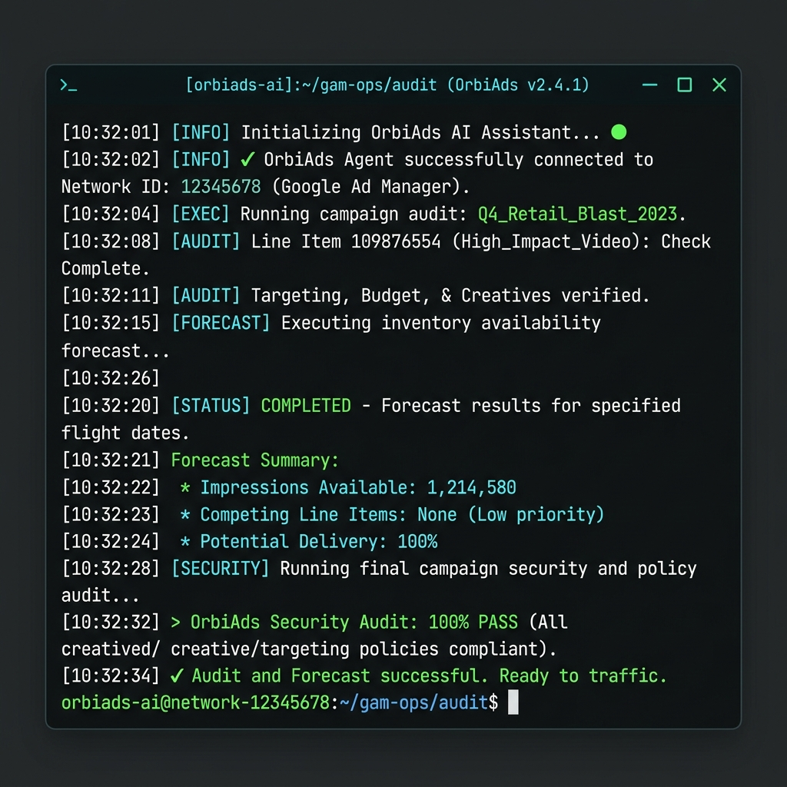

# OrbiAds — Google Ad Manager MCP

[English](README.md) · [Français](README.fr.md)



[](https://modelcontextprotocol.io)
[](https://developers.google.com/ad-manager/api/rel_notes)
[](./version.json)
[](./docs/install/cli.md)
[](./docs/install/claude.md)
[](./docs/install/chatgpt.md)
[](./docs/install/gemini.md)
[](https://glama.ai/mcp/servers/OrbiAds/Orbiads-GAM-MCP)

**Une compétence pour Claude, ChatGPT, Gemini et OpenAI Codex qui donne à votre assistant IA un accès direct à Google Ad Manager (GAM).**

[**→ Commencer gratuitement sur orbiads.com**](https://orbiads.com) · [**★ Star ce dépôt**](https://github.com/OrbiAds/Orbiads-GAM-MCP)

---

## Deux façons de se connecter

OrbiAds propose deux méthodes d'intégration — choisissez celle qui convient le mieux à votre workflow.

### Option A : Serveur MCP (agents IA)

Connectez votre assistant IA (Claude, ChatGPT, Gemini) à GAM via notre point de terminaison MCP hébergé. Conversationnel, guidé et sans installation.

```
Point d'accès MCP : https://orbiads.com/mcp
```

### Option B : CLI (terminal & scripts)

Un CLI Python léger pour les développeurs, les pipelines CI/CD et l'automatisation sans tête (headless). Même API, mêmes crédits et mêmes barrières de sécurité.

```bash
pip install orbiads-cli
orbiads auth login
orbiads network info
```

> [!IMPORTANT]
> **Avertissement PATH (Windows/macOS/Linux)** : Si vous installez le CLI via `pip` (particulièrement avec `--user`), assurez-vous que le dossier des scripts Python est ajouté à votre variable d'environnement `PATH`. Sans cela, votre terminal et les agents IA locaux (comme Claude Code ou Cursor) ne pourront ni localiser ni exécuter la commande `orbiads`. Consultez la [section Dépannage du guide CLI](docs/install/cli.md#troubleshooting) pour obtenir les commandes de configuration rapide.

### Comparatif

| Critère | Serveur MCP | CLI |
| --- | --- | --- |
| Interface | Agent IA (Claude, ChatGPT, Gemini) | Terminal / ligne de commande |
| Installation | URL à coller dans les paramètres de l'agent | `pip install orbiads-cli` |
| Authentification | OAuth via navigateur (automatique) | OAuth Device Flow (code affiché) |
| Idéal pour | L'exploration, les conversations, les workflows guidés | Les scripts, la CI/CD, l'automatisation |
| Format de sortie | Langage naturel via l'agent | JSON ou tableau structuré |
| Crédits | Même grille de consommation | Même grille de consommation |
| Hors-ligne | Non — nécessite internet | Non — nécessite internet |
| Python requis | Non | Oui (3.10+) |

> Les deux méthodes partagent le même backend, les mêmes crédits et les mêmes garde-fous de sécurité.

### Référence rapide du CLI

| Commande | Description |
| --- | --- |
| `orbiads auth login` | Authentification via le flux Google OAuth Device Flow |
| `orbiads auth status` | Vérifier l'état de l'authentification |
| `orbiads network info` | Afficher les détails du réseau GAM actuel |
| `orbiads network list` | Lister les réseaux GAM accessibles |
| `orbiads orders list` | Lister les ordres (orders) du réseau |
| `orbiads line-items list --order ID` | Lister les éléments publicitaires (line items) d'un ordre |
| `orbiads creatives list` | Lister les créations (creatives) |
| `orbiads inventory ad-units` | Lister les blocs d'annonces (ad units) |
| `orbiads forecast check --ad-unit ID` | Vérifier la disponibilité de l'inventaire |
| `orbiads report run --template ID` | Lancer un rapport de diffusion |

> Référence complète des commandes : [orbiads.com/docs/cli/commands](https://orbiads.com/docs/cli/commands)

---

## Guide d'installation

OrbiAds propose trois niveaux d'intégration selon votre environnement.

### 1. Serveur MCP (Sans installation - ChatGPT, Gemini, Claude Desktop)
Connectez votre assistant IA à notre serveur hébergé via le protocole Model Context Protocol :
- **Claude Desktop** : Ajoutez ceci dans votre fichier `claude_desktop_config.json` :
  ```json
  {
    "mcpServers": {
      "orbiads": {
        "type": "http",
        "url": "https://orbiads.com/mcp"
      }
    }
  }
  ```
- **Gemini / AI Studio** : Allez dans Outils → Configuration MCP → Ajouter `https://orbiads.com/mcp`
- **ChatGPT** : Allez dans Paramètres → Connecteurs → Créer connecteur → URL MCP : `https://orbiads.com/mcp`
- **GLAMA / Registre MCP** : Accédez, testez et connectez le serveur directement dans votre navigateur via [glama.ai/mcp/servers/OrbiAds/Orbiads-GAM-MCP](https://glama.ai/mcp/servers/OrbiAds/Orbiads-GAM-MCP)
- **Autres environnements (Cursor, Codex, Warp)** : Ajoutez l'endpoint `https://orbiads.com/mcp` à vos configurations et copiez [`AGENTS.md`](./AGENTS.md) à la racine de votre projet.

### 2. Plugin Claude Code (Slash Commands)
Ajoutez l'ensemble de commandes `/adops` directement dans votre terminal Claude Code :
```bash
claude plugin install orbiads
```

### 3. Skills d'Agent (Workflows structurés)
Installez nos guides opérationnels markdown de manière permanente dans la mémoire de Claude Code :
1. Clonez ce dépôt localement.
2. Lancez l'installateur :
   ```bash
   ./install.sh skills --copy
   ```
Cela copiera nos 6 compétences consolidées dans votre dossier `~/.claude/skills/`. Claude Code les consultera automatiquement pour éviter les hallucinations et appliquer rigoureusement le workflow de validation preview-to-execute.

→ Guides d'installation complets : [Claude](./docs/install/claude.md) · [ChatGPT](./docs/install/chatgpt.md) · [Gemini](./docs/install/gemini.md) · [OpenAI Codex](./docs/install/openai-codex.md)

---

## Qu'est-ce qu'OrbiAds ?

OrbiAds est un **serveur MCP** hébergé qui connecte votre assistant IA directement à Google Ad Manager (GAM). Au lieu de cliquer laborieusement dans l'interface de GAM ou d'écrire des scripts d'API complexes, vous décrivez ce que vous souhaitez en langage naturel — OrbiAds gère les appels d'API, les garde-fous de facturation et l'audit.

```text
Vous : "Vérifie la disponibilité de l'inventaire pour le pavé de la page d'accueil en France la semaine prochaine"
OrbiAds : [lance la prévision] → Disponible : 1,2M d'impressions. Pression : faible. Prêt à diffuser.

Vous : "Crée l'élément publicitaire pour Renault, 15€ du CPM, du lundi au vendredi"
OrbiAds : [applique les garde-fous] → Aperçu prêt. Confirmer la publication ?
```

Pas de scripts. Pas de clés d'API complexes à gérer. Pas de changement d'onglet permanent.

---

## À qui s'adresse ce projet ?

- **Les gestionnaires d'AdOps** qui diffusent des campagnes quotidiennement et veulent travailler plus vite sans faire d'erreurs.
- **Les éditeurs (Publishers)** qui gèrent leur propre réseau GAM et souhaitent des workflows assistés par IA.
- **Les agences média** gérant plusieurs comptes GAM et exigeant un processus cohérent et auditable.
- **Les développeurs** créant des automatisations AdOps basées sur Claude, ChatGPT ou Gemini.

---

## Plateformes IA supportées

| Plateforme | Guide de configuration | Mode |
| --- | --- | --- |
| **Claude** (Desktop / claude.ai / Claude Code) | [docs/install/claude.md](./docs/install/claude.md) | Plugin + MCP distant |
| **ChatGPT** (Connecteur Pro) | [docs/install/chatgpt.md](./docs/install/chatgpt.md) | MCP distant (HTTP) |
| **Gemini** | [docs/install/gemini.md](./docs/install/gemini.md) | MCP distant |
| **GLAMA** (MCP registry) | [glama.ai/mcp/servers/OrbiAds/Orbiads-GAM-MCP](https://glama.ai/mcp/servers/OrbiAds/Orbiads-GAM-MCP) | Registre MCP |
| **Cursor / Codex / Warp / autre** | [AGENTS.md](./AGENTS.md) | Contrat AGENTS.md + configuration MCP |

Toutes les plateformes se connectent au même point de terminaison MCP hébergé à l'adresse `https://orbiads.com/mcp`.

---

## 5 Commandes Slash (Claude Code)

Après avoir installé le plugin, ces commandes `/adops` sont disponibles directement dans Claude Code.

| Commande | Rôle |
| --- | --- |
| `/adops campaign` | Déployer, prévisualiser, suspendre, annuler — avec validation prévisionnelle obligatoire avant toute écriture |
| `/adops audit` | Audit de compte multidimensionnel : diffusion, inventaire, sécurité, créations, facturation |
| `/adops report` | Rapports personnalisés, requêtes de diffusion, export CSV, synthèses de facturation, prévisions |
| `/adops deal` | Deals PMP, enchères privées, propositions de marché (PG/PD) |
| `/adops creative` | Téléverser des créations, QA de conformité, validation SSL, URL de prévisualisation, association aux éléments |

---

## Que contient ce dépôt ? (MCP Tools & Skills)

L'API d'OrbiAds expose **28 outils parents** et plus de **270 actions**, consolidés dans **6 compétences d'Agent (Agent Skills)** pour optimiser l'usage du contexte de l'IA.

Cliquez sur un domaine pour déplier la liste des outils inclus :

<details>
<summary><b>1. Campagnes & QA Créations (orbiads-campaigns)</b></summary>

*   `campaign` — Créer, mettre à jour, mettre en pause et annuler des campagnes.
*   `orders` — Créer et lister les ordres, contacts et rôles.
*   `line_items` — Définir les règles de diffusion des éléments publicitaires, CPM et ciblages.
*   `creatives` — Téléverser les créations (images, HTML5, vidéo/audio) et configurer les styles natifs.
*   `creative_assets` — Gérer les fichiers et images associés.
*   `creative_qa` — Auditer les pixels de tracking, scanner la conformité HTML et valider les certificats SSL.
*   `creative_wrapper_skill` — Gérer les habillages tiers (creatives wrappers) et les presets de diffusion.
*   `formats` — Découvrir et configurer les formats de création.
*   `jobs` & `gam_jobs` — Suivre les tâches asynchrones de déploiement et de compilation de campagne.
</details>

<details>
<summary><b>2. Inventaire & Ciblage (orbiads-inventory)</b></summary>

*   `inventory` — Récupérer l'arborescence des blocs d'annonces, tailles, et générer le manifest ads.json.
*   `placements` — Créer, mettre à jour et lister les groupes d'emplacements (placements).
*   `targeting` — Gérer les clés/valeurs de ciblage personnalisé, pays et catégories d'appareils.
*   `audiences` — Récupérer et modifier les segments d'audience first-party.
*   `blueprint` — Générer et publier des blueprints d'inventaire réseau.
</details>

<details>
<summary><b>3. Rapports & Prévisions (orbiads-reporting)</b></summary>

*   `reporting` — Exécuter des rapports personnalisés, suivre la diffusion, intégrer GA4.
*   `preview` — Vérifier la couverture de diffusion et exporter les URL de prévisualisation.
*   `pql` — Exécuter des requêtes PQL brutes sur les métadonnées.
</details>

<details>
<summary><b>4. Deals Programmatiques (orbiads-deals)</b></summary>

*   `deals` — Gérer les deals PMP, enchères privées et acheteurs programmatiques.
*   `companies` — Gérer les fiches d'annonceurs, d'agences et de partenaires tiers.
</details>

<details>
<summary><b>5. Administration Réseau (orbiads-admin)</b></summary>

*   `gam_admin` — Accéder aux champs avancés, libellés de réseau, équipes et sites.
*   `gam_features` — Interroger les fonctionnalités bêtas et système activées dans GAM.
*   `network` — Lister les codes réseaux accessibles et changer le contexte du réseau actif.
*   `settings` — Configurer les tarifs CPM par défaut, le rythme (pacing) et les gabarits de nommage.
*   `tenant_catalog` — Accéder aux catalogues de services propres au tenant.
</details>

<details>
<summary><b>6. Audits & Facturation (orbiads-audit)</b></summary>

*   `audit_skill` — Lancer des audits automatiques de sécurité, d'hygiène de l'inventaire et d'habillage.
*   `billing` — Consulter les soldes de crédits et l'historique des transactions.
*   `audit` — Rechercher dans les journaux d'audit système de Google Ad Manager.
</details>

> Consultez la matrice complète dans [`docs/tool-matrix/README.md`](./docs/tool-matrix/README.md) pour connaître les coûts exacts, les permissions d'écriture et les paramètres pour les 270+ actions.

---

## Sécurisé par conception (Safety by Design)

Chaque action d'écriture nécessite une confirmation explicite. Aucune campagne ne part en production par accident.

- **Mode Simulation (Dry-run)** sur toutes les actions de déploiement — prévisualisez avant de valider.
- **Validation prévisionnelle obligatoire** avant la réservation de l'inventaire — disponibilité vérifiée en amont.
- **Journal d'audit** complet sur chaque action — qui a fait quoi, quand et avec quel résultat.
- **Gestion des crédits transparente** — les lectures sont gratuites, les écritures déduisent des crédits de manière transparente.

---

## Démarrage rapide (3 étapes)

### 1. Créez votre compte gratuit
Rendez-vous sur [orbiads.com](https://orbiads.com) et inscrivez-vous. Vous recevrez **5 crédits gratuits** — aucune carte bancaire requise.

### 2. Connectez Google Ad Manager
Depuis le tableau de bord OrbiAds, cliquez sur **Connecter GAM** et autorisez avec votre compte Google. OrbiAds utilise le protocole sécurisé OAuth — vos identifiants GAM ne quittent jamais l'infrastructure sécurisée de Google.

### 3. Configurez votre assistant IA
Choisissez votre plateforme et suivez le guide :
- [Configuration pour Claude →](./docs/install/claude.md)
- [Configuration pour ChatGPT →](./docs/install/chatgpt.md)
- [Configuration pour Gemini →](./docs/install/gemini.md)
- [Autres outils (Cursor, Codex, Warp) →](./AGENTS.md)

Puis commencez simplement en demandant à votre agent :
> *"Connecte-toi à mon compte GAM et montre-moi mes réseaux actifs"*

---

## Détails du serveur MCP

| Propriété | Valeur |
| --- | --- |
| Point d'accès (Endpoint) | `https://orbiads.com/mcp` |
| Transport | `streamable-http` (par défaut) · `sse` |
| Authentification | OAuth 2.0 — via votre compte Google connecté à OrbiAds |
| Version de l'API GAM | `v202605` |
| Version du protocole MCP | `2025-03-26` |

---

## Structure du dépôt

```text
skills/           ← Les 6 compétences thématiques consolidées + l'orchestrateur principal
commands/         ← Les 5 commandes slash /adops pour Claude Code
agents/           ← Les agents d'audit parallèles (audit-delivery, audit-inventory, etc.)
hooks/            ← Les hooks pour Claude Code (hooks.json)
cli/              ← Le client Python OrbiAds CLI (pip install orbiads-cli)
docs/             ← Les guides d'installation, matrice d'outils et exemples
_docs/            ← Documentation interne : legacy mapping et règles anti-collision
.claude-plugin/   ← Manifestes du plugin Claude (plugin.json, marketplace.json)
AGENTS.md         ← Contrat cross-LLM universel pour Cursor, Codex, Gemini, Warp, etc.
CLAUDE.md         ← Instructions de contribution pour Claude Code sur ce dépôt
```

---

## Tarifs

| Offre | Prix | Crédits |
| --- | --- | --- |
| Essai | Gratuit | 5 crédits (sans carte) |
| Starter | 39€/mois | 50 crédits/mois |
| Early Access | **29€/mois** ← bloqué à vie | 50 crédits/mois |
| Pack S | 29€ une fois | +50 crédits |
| Pack L | 45€ une fois | +100 crédits |

Les requêtes de lecture sont gratuites. Les crédits ne sont débités que lors des opérations d'écriture ou de déploiement effectif.

[**Essayer gratuitement →**](https://orbiads.com)

---

## Licence

Le contenu de ce dépôt — structure de distribution, compétences, agents, workflows, schémas JSON, client CLI, manifestes d'intégration et exemples — est publié sous licence [MIT](./LICENSE).

Le backend du serveur MCP OrbiAds et les services Cloud Run associés connectés au point d'accès `https://orbiads.com/mcp` ne font pas partie de ce dépôt et sont régis par des conditions d'utilisation propriétaires — [voir les conditions d'utilisation sur orbiads.com](https://orbiads.com).

<p align="center">
  <br/>
  
</p>
